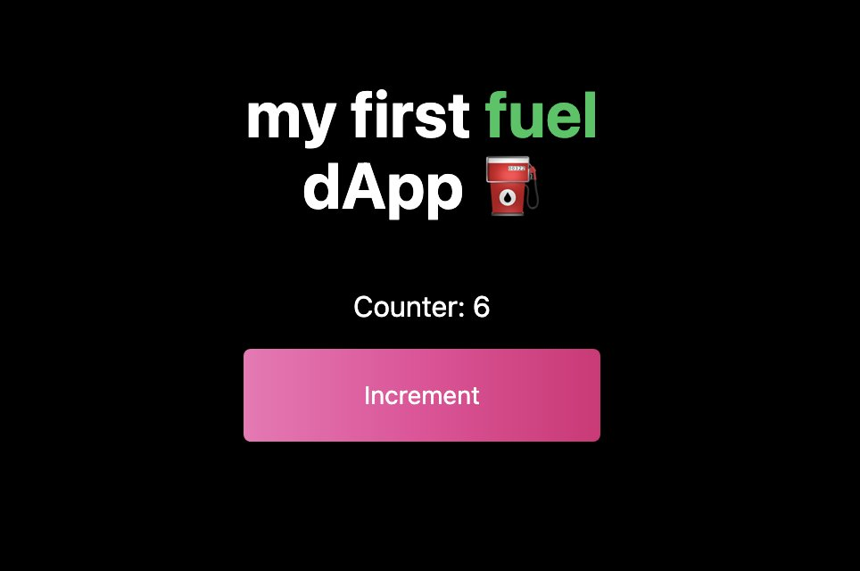

# fuel-quickstart-dapp

Followed the [Developer Quickstart](https://fuellabs.github.io/fuel-docs/master/developer-quickstart.html) to make my first dapp. 

Added some tailwind css for some frontend formatting. 

